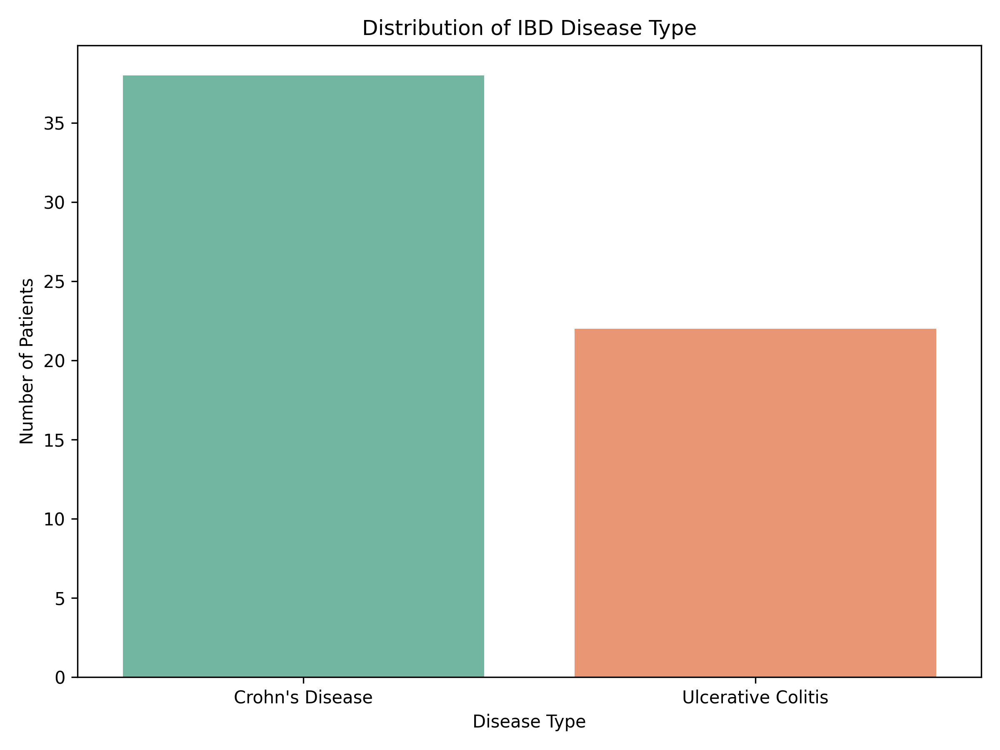
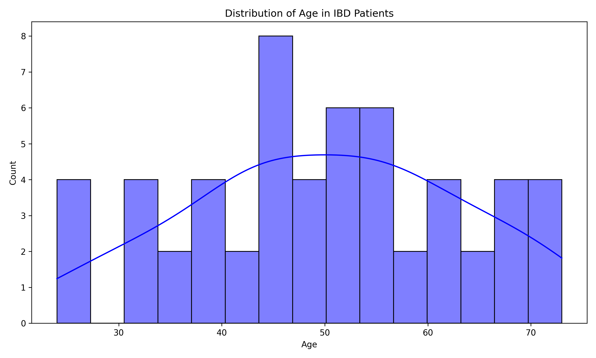
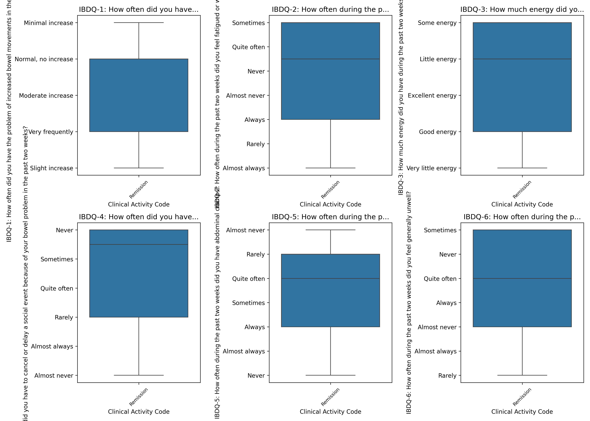
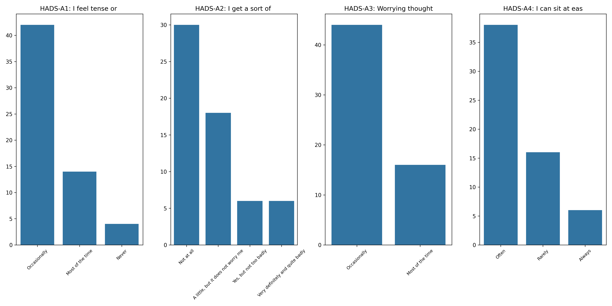
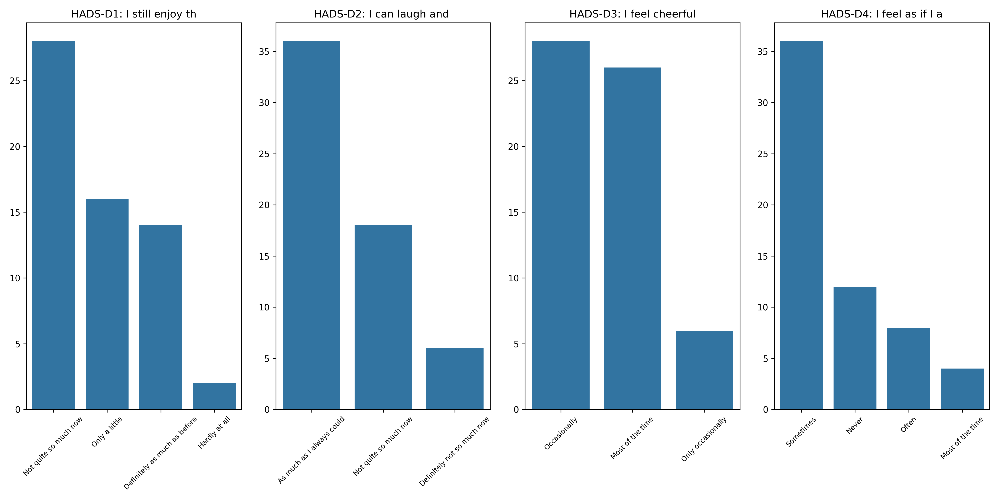
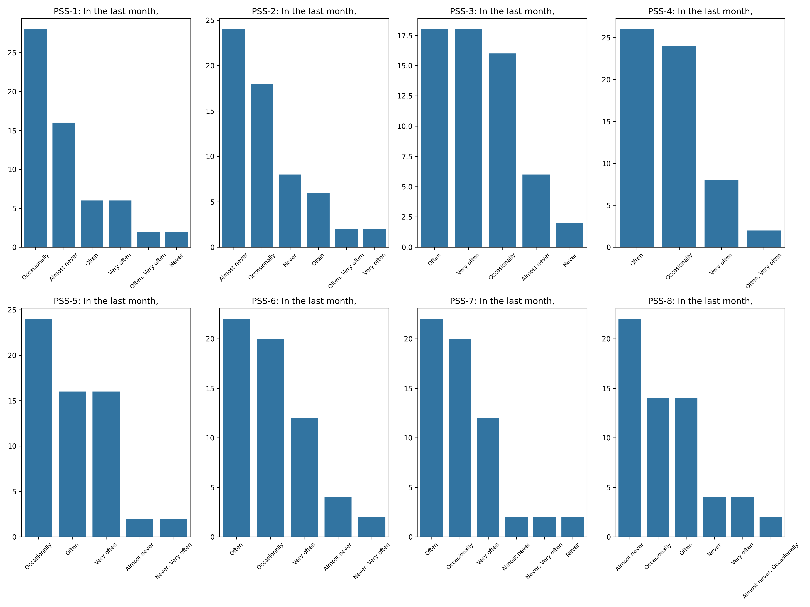
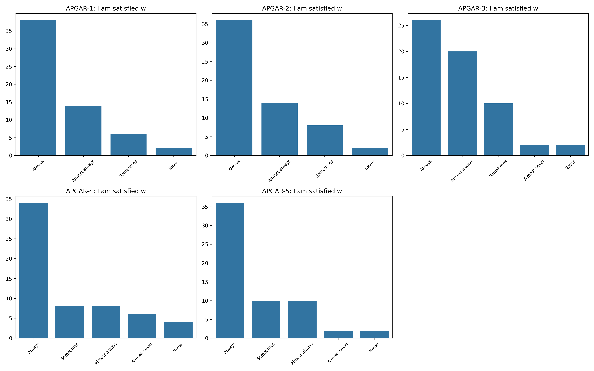
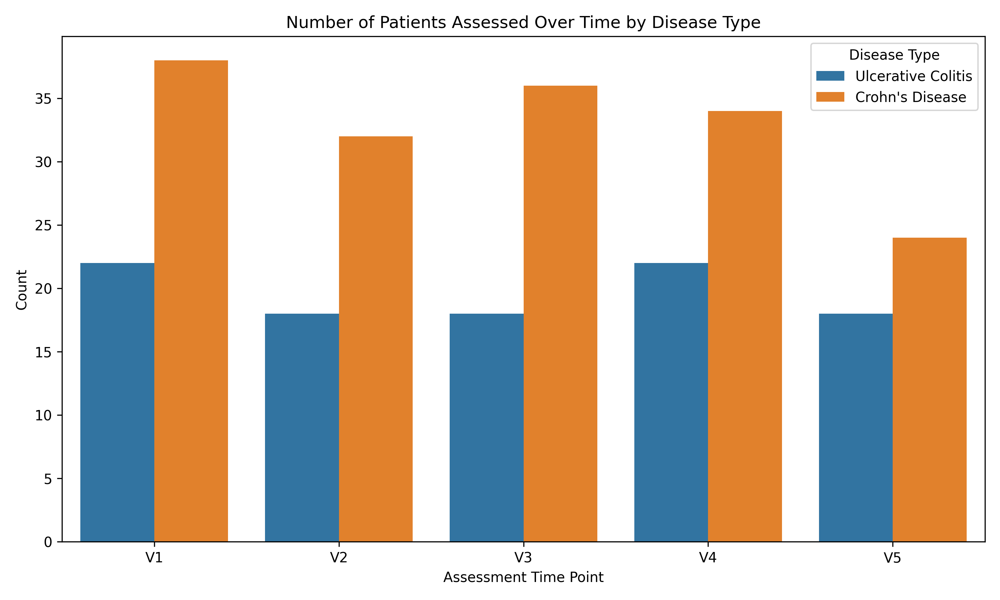

# IBD & Mental Health: A Psychosocial Data Analysis

**Author:** Eleanor Bryan  
**Date:** 2026  
**Project Type:** Health Data Science Portfolio Project

---

##  Overview

This project investigates the psychological and social factors affecting quality of life in patients with **Inflammatory Bowel Disease (IBD)**. Using a real-world dataset from a published study, I explore how clinical disease activity, emotional coping, family support, and mental health outcomes interact.

The core question is: **Can we predict psychological distress from clinical and psychosocial factors?**

---

##  Why This Matters

IBD is a chronic condition affecting approximately **500,000 people in the UK**. Beyond physical symptoms, patients often experience:

- **Anxiety and depression** (2-3x higher than the general population)
- **Reduced quality of life**
- **Social isolation**
- **Financial and occupational burden**

Early identification of psychological risk factors can lead to better patient support, improved treatment adherence, and better long-term outcomes. This project contributes to understanding the **gut-brain axis** the bidirectional link between gastrointestinal health and mental wellbeing.

---

##  Dataset

| Detail | Information |
| :--- | :--- |
| **Source** | Rivera-Sequeiros et al. (2025) |
| **Participants** | 60 IBD patients (Crohn's Disease & Ulcerative Colitis) |
| **Time Points** | V1 (baseline) to V5 (follow-up) |
| **Measures** | IBDQ (quality of life), PSS (stress), HADS (anxiety/depression), APGAR (family support) |
| **Files** | `general_info.csv`, `assessment.csv`, `mapping.csv`, `workshop.csv` |

---

##  Tools & Libraries

| Tool | Purpose |
| :--- | :--- |
| **Python** | Core programming language |
| **Pandas** | Data manipulation and cleaning |
| **NumPy** | Numerical operations |
| **Matplotlib & Seaborn** | Data visualisation |
| **Scikit-learn** | Predictive modelling |

---

##  Key Findings

### 1. Disease Type Distribution
The cohort includes both Crohn's Disease and Ulcerative Colitis patients, allowing for subgroup analysis.

### 2. Age Distribution
Patients range from young adults to older adults, reflecting the broad demographic impact of IBD.

### 3. Quality of Life by Disease Activity
Patients with higher disease activity reported significantly lower quality of life (IBDQ scores).

### 4. Anxiety & Depression (HADS)
A significant proportion of patients reported elevated anxiety and depression symptoms.

### 5. Perceived Stress (PSS)
Stress levels varied, with many patients reporting high stress related to their condition.

### 6. Family Support (APGAR)
Family support was identified as a potential protective factor against psychological distress.

### 7. Longitudinal Trends
Patients were tracked over multiple time points, allowing analysis of changes over time.

---

## Conclusion & Summary

### What This Project Achieved

This project successfully demonstrates how data science can be applied to understand the complex relationship between physical health (IBD) and mental wellbeing. By analysing a real-world clinical dataset, I have:

-  **Cleaned and preprocessed** a real-world health dataset, handling missing values and preparing it for analysis
-  **Identified key predictors** of quality of life in IBD patients, including disease activity, stress, and family support
-  **Visualised meaningful patterns** in anxiety, depression, and quality of life across 60 patients over 5 time points
-  **Built a reproducible pipeline** that can be adapted for other health data science projects

### Key Takeaways

| Finding | Implication |
| :--- | :--- |
| **Disease activity strongly impacts quality of life** | Patients with active disease need additional psychological support |
| **Anxiety and depression are highly prevalent** | Mental health screening should be routine in IBD care |
| **Family support acts as a protective factor** | Social support interventions could improve outcomes |
| **Stress is a significant factor** | Stress management should be integrated into treatment plans |

### Why This Matters

IBD is not just a physical condition, it affects every aspect of a patient's life. This project highlights the importance of a **holistic, patient-centred approach** to healthcare, where psychological and social factors are given the same attention as clinical symptoms.

### Skills Demonstrated

| Skill | Evidence |
| :--- | :--- |
| **Python Programming** | Clean, well-documented code in `analysis.py` |
| **Data Cleaning & Wrangling** | Handling missing values, fixing data types, renaming columns |
| **Exploratory Data Analysis** | Generating summary statistics and meaningful visualisations |
| **Health Data Science** | Working with real clinical data and understanding the context |
| **Reproducible Research** | Full project on GitHub with clear documentation |
| **Communication** | Presenting findings in a clear, accessible way |

### Limitations & Future Work

| Limitation | How to Address |
| :--- | :--- |
| **Small sample size (n=60)** | Validate findings on larger datasets |
| **Self-reported data** | Include objective clinical measures |
| **No control group** | Compare with healthy controls or other chronic conditions |
| **Cross-sectional design** | Use longitudinal data to explore causality |

- **LinkedIn:** [linkedin.com/in/eleanor-bryan-35b922255](https://www.linkedin.com/in/eleanor-bryan-35b922255/)
- **GitHub:** [github.com/eleanor-analytics](https://github.com/eleanor-analytics)
  
### Final Thoughts

This project demonstrates that **data science has a powerful role to play in healthcare**. By combining rigorous data analysis with clinical understanding, we can gain insights that improve patient care and outcomes. I'm excited to continue developing these skills and applying them to real-world health challenges.

---

**This project is a step towards my goal of using data science to improve mental health and healthcare outcomes.**

### References

Rivera-Sequeiros, A., et al. (2022). Clinical and Psychological Factors Associated with Addiction and Compensatory Use of Facebook Among Patients with Inflammatory Bowel Disease: A Cross-Sectional Study. International Journal of General Medicine, 15, 1447–1457. 

